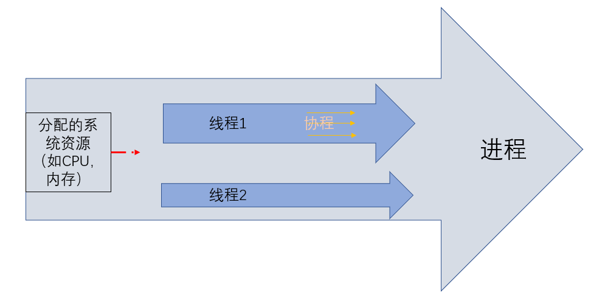

# Python中的进程、线程与协程

## GIL全局解释器锁

**GIL**是一个互斥锁，CPython（Python解释器）以此限制了**同一时间内只能由一个线程运行**，阻止了多个线程同时执行Python字节码。

Python最初的设计理念在于，**为了解决多线程之间数据完整性和状态同步的问题，设计为在任意时刻只有一个线程在解释器中运行**。
在执行多线程程序时，由GIL来控制同一时刻只能有一个线程能运行。
因此，Python中的多线程实际上仍是由GIL控制的多个线程交替执行的并发程序。

**GIL锁最终是保证Python解释器中原子操作的线程安全。**

**GIL是怎么起作用的：**

* 由于GIL的机制，单核CPU在同一时刻只有一个线程在运行，当线程遇到IO操作或者
  Time Tick到期时，释放GIL锁。其他线程去竞争这把锁，得到锁之后才开始运行。
* 在多核CPU下，由于GIL锁的全局特性，无法发挥多核的优势，GIL锁会使得多线程
  任务效率大大降低。线程1在CPU1上运行，线程2在CPU2上运行，而GIL是全局的，
  CPU2上的线程需要等待CPU1上的线程让出GIL锁才有可能执行。为避免同一线程
  霸占CPU，在Python3.x中线程会自动调整自己的优先级，避免一核忙碌一核闲置
  的情况。

**GIL的优缺点：**

* 优点：GIL保证在多线程编程时无需考虑多线程之间的数据完整性核状态同步的问题。
* 缺点：多线程程序是并发执行而不是并行执行，执行效率很低。

在Python编程中，如果想利用计算机的多核提高程序执行效率，可以使用多进程代替多线程。
使用多进程的好处是完全并行，无GIL限制，可以充分利用多核CPU对象环境。

一般而言使用多进程对计算机资源占用较多，但在类unix系统中创建线程的开销并不比
进程小，因此在并发操作时，多线程的效率受到了很大制约。后来人们发现通过使用
yield来中断代码片段的执行，同时交出了CPU的使用权，于是**协程**的概念产生了。

## 进程、线程与协程

* 进程：系统资源分配的最小单位
* 线程：程序执行的最小单位
* 协程：不被操作系统内核管理，完全由程序控制，在用户态执行。

一个程序在计算机上运行时，操作系统会以进程为单位，分配系统资源（CPU时间片、
内存等），当进程存在多个线程时，由于GIL锁，系统资源会以某种算法分配给其中一个线程供其使用。
遇到IO操作或Time Tick到期（执行完100个字节码指令或者15ms）后，此线程被设置为睡眠状态，
系统资源再分配给其他线程，这就是Python中的多线程。

* 对于CPU密集型代码(如循环计算) 多进程效率更高
* 对于IO密集型代码(如文件操作、网络爬虫) 多线程效率更高
* 对于IO密集型操作，大部分消耗时间是等待时间，在等待期间CPU不需要工作，无法利用多个CPU资源，
  而等待时GIL锁会被释放供行的线程使用，实现了线程的切换；而对于CPU密集型代码多个CPU工作效率自然更高。

---

### 进程与线程

| 维度       | 多进程                | 多线程                 |
|----------|--------------------|---------------------|
| 数据共享、同步  | 进程间数据独立、共享复杂、同步简单  | 各线程共享进程数据、共享简单、同步复杂 |
| 内存、CPU   | 占用内存多，切换复杂，CPU利用率低 | 占用内存少，切换简单，CPU利用率高  |
| 创建、销毁、切换 | 复杂、速度慢             | 简单、速度快              |
| 编程调试     | 简单                 | 复杂                  |
| 可靠性      | 进程间不会互相影响          | 线程崩溃将导致整个进程崩溃       |

---

协程的概念由进程和线程演变而来，**协程并不真实存在，只是人为设想的一种产物，由程序或用户随意切换执行**。
协程在子程序内部可随时中断转而执行别的子程序，在适当的时候再返回来接着执行。

**协程的优势：**

* **极高的执行效率**：**子程序切换不是线程切换而是程序自身控制，没有线程切换的开销**。与多线程相比，
  线程数量越多，协程的性能优势越明显。
* **不需要多线程的锁机制：** 因为只有一个线程，不存在写变量冲突，在协程中控制共享资源不加锁，
  只需要判断状态，执行效率比多线程高很多。

python通过`yield/send`的方式实现协程，以此程序员可控制函数的中断与执行。

